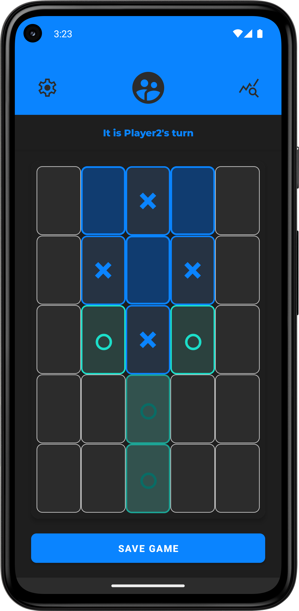

# TicTacTwo

A modern twist on the classic Tic-Tac-Toe game for Android. TicTacTwo introduces a movable grid and dynamic game mechanics to provide a fresh, challenging experience.
1 out of 7 TicTacTwos made for uni in 2024-2025.

## Version

Current Version: 1.0

## Game Overview

TicTacTwo expands on traditional Tic-Tac-Toe with these key features:
- 5x5 board with a 3x3 active play area (grid)
- Each player has 6 markers to place during the game (4 is not enough in my opinion)
- All player interactions (placing and moving markers) are restricted to the active 3x3 grid
- Game progresses in two phases:
  - Initial placement phase: Players take turns placing markers within the active grid
  - Advanced phase: After both players place 3 markers, they can move existing markers and shift the grid
- Players can swipe to shift the active 3x3 grid in four directions (after placing 3 markers)
- Win by creating a row of 3 matching markers within the active grid

## Installation

### Prerequisites
- Android Studio (Latest stable version recommended)
- Minimum SDK: Android 9.0 (API level 28)
- Target SDK: Android 14 (API level 34)
- Kotlin

### Clone and Build
1. Clone the repository:
   ```
   git clone https://github.com/IMaeots/TicTacTwoAndroid.git
   ```
2. Open the project in Android Studio
3. Sync Gradle files
4. Build the project by selecting `Build > Make Project`
5. Run on an emulator or physical device by selecting `Run > Run 'app'`

## App Features

- **Gameplay:** Core TicTacTwo game with progressive mechanics that unlock as the game advances
- **Save/Load:** Save games locally in progress and load them later
- **Statistics:** Track locally wins for each player and draws
- **Settings:** Basic game settings, currently only including a background music toggle
- **Simple onboarding screen** welcome screen to start playing a new or saved game
- **Responsive UI:** Optimized for both portrait and landscape orientations with adaptive layouts, supports dark and light themes

## Project Structure

The project uses a straightforward architecture organized into logical folders:

- **domain**: Contains game logic, data models, and business rules
- **data**: Handles data persistence with a simple SQLite implementation
- **viewmodels**: Manages UI state and connects the UI with business logic
- **views**: Contains UI elements like fragments and custom components
- **service**: Contains utility services
- **res**: Organized resource files

This pragmatic approach prioritizes simplicity and readability, making it suitable for a small-sized game application without overcomplicating the architecture.

## Technologies Used

- Kotlin
- XML and Fragment-based UI
- SQLite Database (simple custom implementation)
- ViewBinding
- Coroutines & Flow for state management
- Material Design components
- Custom View components for game board elements

## Screenshots



## Notes

Yes, going to settings or stats loses your game progress.
Yes, there are issues and code could use improvements.

## License

[All Rights Reserved]

## Author

Indrek Mäeots  
School Email: inmaeo@taltech.ee
